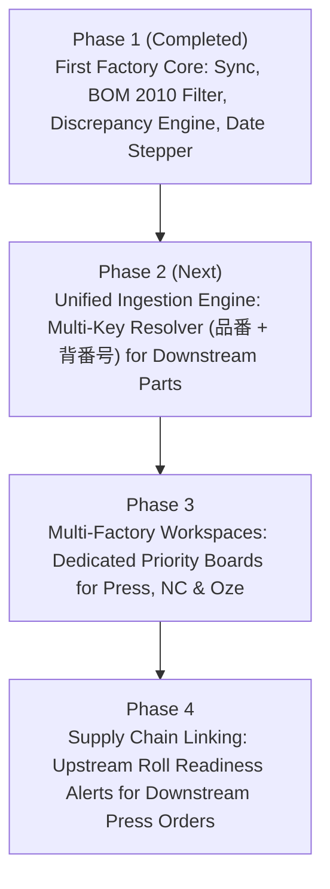

# Production Planning & Excel Synchronization System Architecture

## 1. Executive Summary & Vision
This document outlines the architecture, data models, Excel sheet layouts, MongoDB collections, and step-by-step upgrade phases for Sasaki Coating's **Company-Wide Production Planning & Scheduling System**.

The ultimate goal is to establish the company's **Monthly Google Drive Excel Sheet as the Single Source of Truth (SSOT)** for production targets, delivery schedules, and inventory balances, while empowering factory supervisors in `freyaAdmin2` to execute machine sequencing, lot prioritization, and floor tracking in real time.

---

## 2. The Source of Truth: Monthly Google Drive Excel Sheet

* **Google Drive Spreadsheet ID**: `1TymNilkdnMSsm_5fqyxb1YMp6lcxIBFO`
* **Google Drive Link**: [Open Google Sheet](https://docs.google.com/spreadsheets/d/1TymNilkdnMSsm_5fqyxb1YMp6lcxIBFO?rtpof=true&usp=drive_fs)
* **Sheet Tab Naming Convention**: `YYYY年M月` (e.g. `2026年8月`, `2026年9月`)
* **Column Layout**:
  * **Col A**: Category / Section / Hinban / Drawing
  * **Col B**: Product ID / Drawing Code / Sub-code
  * **Col C–E**: Specs, Inventory Initial Stock, Row Labels (`出荷`, `受注`, `生産`, etc.)
  * **Col F onwards (Index 5 to 35)**: Days 1 through 31 of the selected month.

---

### The Two Distinct Row Patterns in the Sheet

```
+---------------------------------------------------------------------------------------------------+
| PATTERN A: First Factory Products (Coating / 粘着工場) - 3 Rows                                   |
+---------------------------------------------------------------------------------------------------+
| Row 1 [Header / Stock] : Col A = 20-char Hinban (e.g. C13/3D1Z9DG3D/***W12), Running Balance (残数) |
| Row 2 [Orders]         : Label = '受注' (Roll specs e.g. 40m/巻乱, Order qty per day)              |
| Row 3 [Production]     : Label = '生産' (Coating code e.g. ○GD Z1Z9 0RH26, Target production qty) |
| Row 4                  : (0 Rows Below) Next Hinban begins immediately!                           |
+---------------------------------------------------------------------------------------------------+

+---------------------------------------------------------------------------------------------------+
| PATTERN B: Finished / Downstream Products (Press / NC / Oze) - 4 Rows                             |
+---------------------------------------------------------------------------------------------------+
| Row 1 [Header / Stock] : Col A/B = Model or Part (e.g. E1CM ○TD, BTU/GN520-02591), Balance        |
| Row 2 [Shipment]       : Label = '出荷' (with '取数：', Shipment quantities per day)               |
| Row 3 [Production]     : Label = '生産' (with '必要ｍ数：', Planned production quantity per day)    |
| Row 4 [Formula / Sub]  : Col B = Material / Sub-assembly code (e.g. 6CMC0-1CMY2-TT, N59, I01),     |
|                          shows computed decimals (e.g. 1159.2, 1200.6)                            |
+---------------------------------------------------------------------------------------------------+
```

---

## 3. MongoDB Databases & Collections

### Database 1: `Sasaki_Coating_MasterDB`
| Collection | Purpose | Key Fields |
| :--- | :--- | :--- |
| **`firstFactoryProduction`** | Monthly synced production requirements from Excel. | `month`, `hinban`, `orders[31]`, `production[31]`, `syncedAt` |
| **`materialMasterDB3`** | Material master specs & attributes. | `品番`, `品目マスタ` (`工程コード`, `梱包数`, `ラベル品番`), `resolved`, `品番構造` |
| **`bomMasterDB`** | Bill of Materials & Process definitions. | `品番`, `BOM` (`工程コード: 2010`, `工程名: '粘着工程'`, `作業時間`, `原単位`) |

### Database 2: `submittedDB`
| Collection | Purpose | Key Fields |
| :--- | :--- | :--- |
| **`firstFactorySchedule`** | Saved daily priority sequencing by date. | `type: 'dailySchedule'`, `month`, `date`, `scheduleOrder`, `startTime`, `scheduledBy` |
| **`firstFactoryProduction`** | Live execution status & roll check-offs. | `month`, `date`, `status: 'completed'/'pending'`, `actualMeters`, `operator` |

### Database 3: Factory Product Master (`MasterDB` / Oze DB)
| Collection | Purpose | Key Fields |
| :--- | :--- | :--- |
| **`masterDB`** | Downstream press/cutting finished products. | `品番`, `背番号`, `モデル`, `品名`, `材料背番号`, `加工設備`, `工場: '小瀬'` |

---

## 4. `freyaAdmin2` Frontend Architecture

* **Primary Component**: [`FirstFactoryPage.jsx`](file:///Users/karlsome/Documents/GitHub/freyaAdmin2/src/pages/FirstFactoryPage.jsx)
* **Key Features**:
  1. **Excel Synchronizer**: Fetches binary `.xlsx` stream via backend Google Drive proxy, parses client-side with `xlsx`, and persists to `firstFactoryProduction`.
  2. **Strict BOM 2010 Validation**: Filters the available pool to only include products with active Coating Process 2010.
  3. **Roll Slicing Engine**: Computes roll counts and durations based on `梱包数` and BOM `作業時間`.
  4. **Single-Date Discrepancy Auto-Alignment**: Non-destructively compares scheduled items against latest Excel sync and isolates changes strictly to the active date.
  5. **Quick Date Navigation**: Left/Right stepper arrows, popover calendar, and color-coded Day of Week badges (`土曜日 (Sat)`, `日曜日 (Sun)`).

---

## 5. Phase-by-Phase Upgrade Roadmap



### Phase 1: First Factory Core (COMPLETED ✅)
* [x] Direct Excel synchronization for `2026年X月` tabs.
* [x] Parser support for First Factory 3-row layout (`[Hinban]` $\rightarrow$ `[受注]` $\rightarrow$ `[生産]`).
* [x] Process 2010 (粘着工程) verification against `bomMasterDB`.
* [x] Date-isolated Auto-Alignment for single dates with discrepancy banners and warning pills.
* [x] Quick navigation stepper with English/Japanese Day of the Week indicators.

---

### Phase 2: Centralized Ingestion & Multi-Key Candidate Resolver (UPCOMING ⏳)
* **Goal**: Expand Excel parsing to extract all downstream products (Press / NC / Oze / Honsha) without manual typing.
* **Algorithm**:
  1. Detect `出荷` + `生産` anchor blocks.
  2. Read candidate strings in the $-1$ and $+1$ rows.
  3. Query `masterDB` using a multi-key map (`品番`, `背番号`, `材料背番号`, `モデル`).
  4. Store the structured records in a unified table `unifiedProductionPlan`.

---

### Phase 3: Multi-Factory Scheduling Boards (FUTURE 🚀)
* **Goal**: Provide Oze, Honsha Press, and Slitter teams with dedicated Kanban/Sequence boards like First Factory.
* **Capabilities**:
  * Each factory sees only its respective machines and work orders.
  * Drag-and-drop sequencing per machine (e.g. `OZNC01`, `OZNC02`, `Press #3`).

---

### Phase 4: Cross-Factory Lead-Time Linker (FUTURE 🌟)
* **Goal**: Automatically link upstream raw material coating to downstream cutting.
* **Capabilities**:
  * If a press order is scheduled for August 25, the system automatically checks if the required `C13/...` coating roll is scheduled in First Factory by August 22.
  * Visual warnings if upstream supply will not arrive in time for downstream press cutting.
